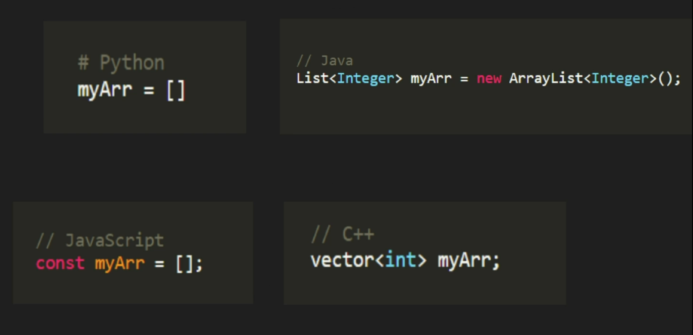

## What is a Data Structure
- structuring data inside RAM
- RAM is measured in bytes (1 Byte = 8 bits)
- 1 bit can store a single digit which can be either 0 or 1

## 1 GB = how many bytes?
It depends on whether you’re talking about **decimal (GB)** or **binary (GiB)**:

* **Decimal (used by storage manufacturers):**
  1 GB = **1,000,000,000 bytes** (10⁹ bytes)

* **Binary (used by operating systems,RAM, sometimes written as GiB):**
  1 GiB = **1,073,741,824 bytes** (2³⁰ bytes)

---
 
 - RAM is a block of data where values are stored and each having a distinct address

---
## 1. Arrays
### static arrays
- In Python and JS, arrays are dynamic by default

### dynamic arrays

- double the capacity when we run out of space O(n)
- this is called amortized time complexity ie it took O(n) when we ran out of space but it is less frequent and most of the times it is O(1) so we will call this "O(1) amortized time complexity" (pushing a value to a dynamic array)
- all the complexties are same as that of static arrays(see figure abv)
---