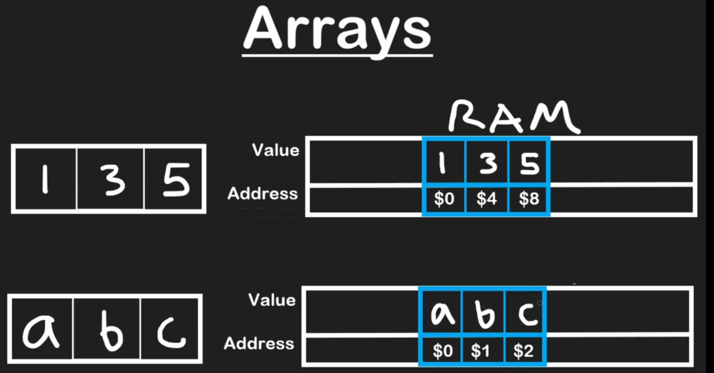
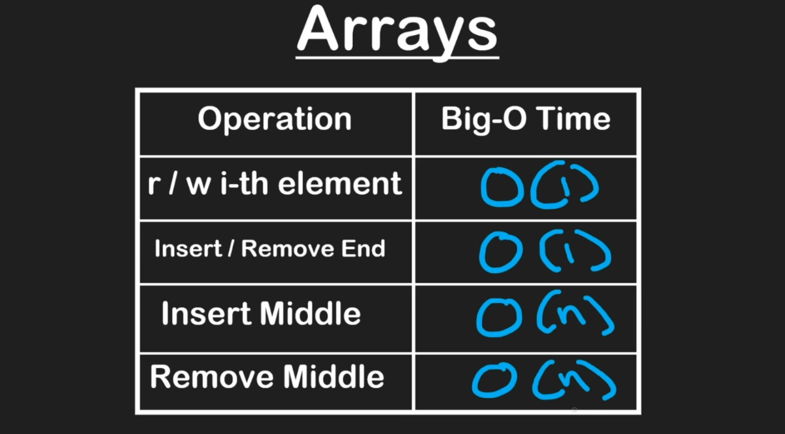

## What is a Data Structure
- structuring data inside RAM
- RAM is measured in bytes (1 Byte = 8 bits)
- 1 bit can store a single digit which can be either 0 or 1

## 1 GB = how many bytes?
It depends on whether you’re talking about **decimal (GB)** or **binary (GiB)**:

* **Decimal (used by storage manufacturers):**
  1 GB = **1,000,000,000 bytes** (10⁹ bytes)

* **Binary (used by operating systems,RAM, sometimes written as GiB):**
  1 GiB = **1,073,741,824 bytes** (2³⁰ bytes)

---
 
 - RAM is a block of data where values are stored and each having a distinct address

---
## 1. Arrays

---